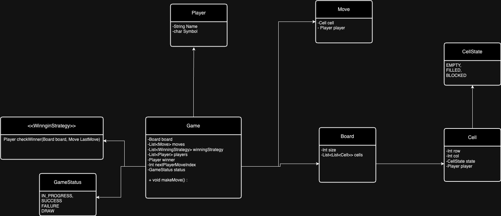

# Tic Toc Toe

## Features
    - The game should allow customization of the board size to be n*n, where n is a positive integer (e.g., 3x3, 4x4, etc.).
    - Players can choose to play against a computer bot or against another human player.
    - Implement different strategies for the computer bot to make moves:
        - Random move strategy: Bot makes random valid moves.
        - Basic strategy: Bot tries to block opponents and aim for a win if possible.
        - Advanced strategy: Bot employs more sophisticated algorithms (e.g., Minimax) to anticipate and counter opponent moves.
    - Provide multiple difficulty levels for the bot, each associated with a different strategy:
        - Easy: Bot makes simple moves, suitable for beginners.
        - Medium: Bot uses basic strategy to provide a challenge.
        - Hard: Bot employs advanced strategies, making it more difficult to beat.
## Clas Diagram

